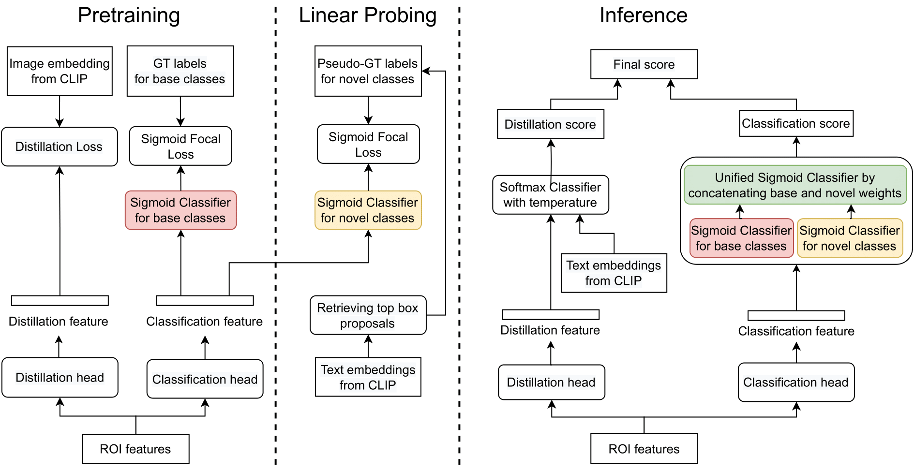

#### **Table of contents**
1. [Introduction](#pytorch-implementation-of-lp-ovod-open-vocabulary-object-detection-by-linear-probing-wacv-2024)
2. [Requirements](#requirements)
3. [Preparation](#preparation)
4. [Training and Testing](#training-and-testing)
5. [Contacts](#contacts)


# **PyTorch implementation of LP-OVOD: Open-Vocabulary Object Detection by Linear Probing (WACV 2024)**
<a href="https://arxiv.org/abs/2310.17109"></a>

Chau Pham, Truong Vu, Khoi Nguyen<br>
**VinAI Research, Vietnam**

> **Abstract:** 
Preparing training data for deep vision models is a labor-intensive task. To ad-
dress this, generative models have emerged as an effective solution for generating
synthetic data. While current generative models produce image-level category
labels, we propose a novel method for generating pixel-level semantic segmen-
tation labels using the text-to-image generative model Stable Diffusion (SD). By
utilizing the text prompts, cross-attention, and self-attention of SD, we introduce
three new techniques: class-prompt appending, class-prompt cross-attention, and
self-attention exponentiation. These techniques enable us to generate segmentation
maps corresponding to synthetic images. These maps serve as pseudo-labels for
training semantic segmenters, eliminating the need for labor-intensive pixel-wise
annotation. To account for the imperfections in our pseudo-labels, we incorporate
uncertainty regions into the segmentation, allowing us to disregard loss from those
regions. We conduct evaluations on two datasets, PASCAL VOC and MSCOCO,
and our approach significantly outperforms concurrent work.


Details of the model architecture and experimental results can be found in [our following paper](https://arxiv.org/abs/2310.17109).<br>
Please **CITE** our paper whenever this repository is used to help produce published results or incorporated into other software.
```bibtex
@inproceedings{pham2024lp,
  title={LP-OVOD: Open-Vocabulary Object Detection by Linear Probing},
  author={Pham, Chau and Vu, Truong and Nguyen, Khoi},
  booktitle={Proceedings of the IEEE/CVF Winter Conference on Applications of Computer Vision},
  pages={779--788},
  year={2024}
}
```

## Requirements
+ python3.8
+ pytorch 1.7.0

```
pip install -r requirements/build.txt
pip install -e .
pip install git+https://github.com/openai/CLIP.git
pip uninstall pycocotools -y
pip uninstall mmpycocotools -y
pip install mmpycocotools
pip install git+https://github.com/lvis-dataset/lvis-api.git
pip install mmcv-full==1.2.5 -f https://download.openmmlab.com/mmcv/dist/cu110/torch1.7.0/index.html
conda install -c pytorch faiss-gpu
```

## **Preparation**
### Data
Download the following dataset [COCO](https://cocodataset.org/#home). 

All models use the backbone pretrained with [SoCo](https://github.com/hologerry/SoCo). Download the [pretrained backbone](https://drive.google.com/file/d/1z6Tb2MPFJDv9qpEyn_J0cJcXOguKTiL0/view) and save to the folder `weights`. Also save the pretrained CLIP model to `weights`. 

### Code structure
```
├── configs
├── mmdet
├── weights
├── tools
├── prepare
├── retrieval
├── scripts
├── ovd_coco_text_embedding.pth
├── data
│   ├── coco
│   │   ├── annotations
│   │   ├── train2017
│   │   ├── val2017

```

### Extract the CLIP text embeddings for COCO classes (Optional)
```
python ./prepare/clip_utils.py
```
A file `ovd_coco_text_embedding.pth` will be created (we have already extracted this for you).

### Download OLN proposals
Download OLN proposals from [this link](https://github.com/VinAIResearch/LP-OVOD/releases/download/v1.0/coco_proposals.pkl).

### Extract the CLIP visual embeddings on pre-computed proposals
This embeddings will be used for computing the Knowledge Distillation loss and retrieving novel proposals
```
python -m torch.distributed.launch --nproc_per_node=4 prepare/extract_coco_embeddings_clip.py \
    --data_root=path_to_data_root \
    --clip_root=weights \
    --proposal_file=path_to_oln_proposals \
    --num_worker=48 \
    --batch_size=128 \
    --split=train \
    --save_path=coco_clip_emb_train.pth \
```
Change `num_workers` and `batch_size` according to your machine.
A file `coco_clip_emb_train.pth` (which is over 100GB) will be created, so please check for enough disk space before extracting.

## Training and Testing
### Pretraining for Base Classes
```
sh ./scripts/vild_sigmoid.sh
```

### Few-shot Fine-tuning for Novel Classes
```
sh ./scripts/vild_sigmoid_ft.sh
```

### Test the model on Both Base and Novel Classes
```
sh ./scripts/vild_sigmoid_test.sh
```
You should change the checkpoint in each script accordingly to the path in your machine.
### Evaluation with pre-trained models
<table><tbody>
<!-- START TABLE -->
<!-- TABLE HEADER -->
<th valign="bottom">Novel AP</th>
<th valign="bottom">Base AP</th>
<th valign="bottom">Overall AP</th>
<th valign="bottom">download</th>
<!-- TABLE BODY -->
<!-- ROW: with LSJ -->
 <tr>
<td align="center">40.5</td>
<td align="center">60.5</td>
<td align="center">55.2</td>

<td align="center"><a href="https://github.com/VinAIResearch/LP-OVOD/releases/download/v1.0/vild_sigmoid_ft.pth">model</a></td>
</tr>
</tr>


</tbody></table>

## **Contacts**
If you have any questions about this project, contact via truongvu0911nd@gmail.com or open an issue in this repository